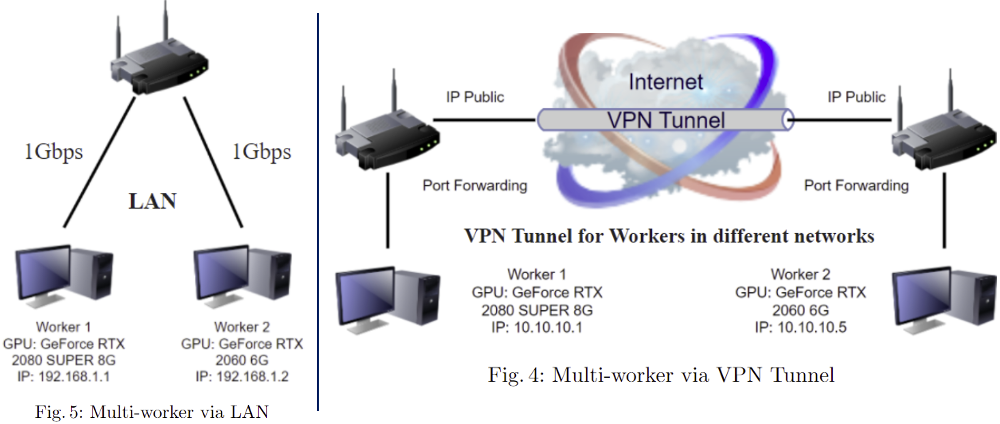
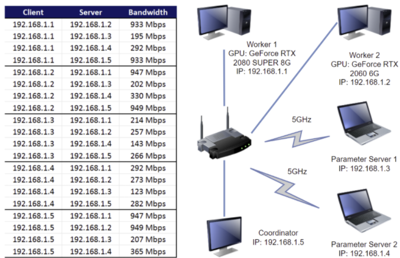

# ML Distributed training
> Demo: https://youtu.be/OOPVA-eqBTY

## Introduction
This project leverage the power of multiple GPUs with the target is to reduce the training time of complex models by data parallelism method with 2 approaches:
1. Multi-worker Training using 2 PCs with GeForce RTX GPU as Workers via:
    -  Local area network (LAN). 
    -  VPN tunnel using [OpenVPN ](https://openvpn.net) (not included in the demo). 
2. Parameter Server Training using 5 machines in LAN:
    - 2 Laptops as Parameter Server connected via 5GHz Wi-Fi.
    - 2 PCs with GeForce RTX GPU as Workers.
    - 1 PC just with CPU as a Coordinator.
     
## Dataset 

We used our self-built [30VNFoods](https://github.com/18520339/30VNFoods) dataset which includes collected and labeled images of 30 famous Vietnamese dishes. This dataset is divided into:
- 17,581 images for training. 
- 2,515 images for validation. 
- 5,040 images for testing. 

In addition, we also used a small [TensorFlow flowers](https://storage.googleapis.com/download.tensorflow.org/example_images/flower_photos.tgz) dataset with about 3700 images of flowers, which includes 5 folders corresponding to 5 types of flowers (`daisy`, `dandelion`, `roses`, `sunflowers`, `tulips`).

## Setup
|                   |            |
|-------------------|------------|
| Image size        | (224, 224) |
| Batch size/worker |     32     |
| Optimizer         |    Adam    |
| Learning rate     |    0.001   |

The [iperf3](https://github.com/esnet/iperf) tool is used to measure the [bandwidth](bandwidth.csv) of machines in network.
### 1. Multi-worker Training

### 2. Parameter Server Training 

## Result

|  Training method  |   Dataset   |   Connection   | Avg. s/epoch |
|:-----------------:|:-----------:|:--------------:|:------------:|
| **Single-worker** | **flowers** |     **LAN**    |    **14**    |
|    Multi-worker   |   flowers   |       LAN      |      18      |
|  **Multi-worker** | **flowers** | **VPN Tunnel** |    **635**   |
|    Multi-worker   |  30VNFoods  |       LAN      |      184     |
|  Parameter Server |  30VNFoods  |       LAN      |      115     |

&rArr; For more information, see [Report.pdf](Report.pdf).

## References
- [Distributed training with Keras](https://www.tensorflow.org/tutorials/distribute/keras)
- [A friendly introduction to distributed training (ML Tech Talks)](https://youtu.be/S1tN9a4Proc)
- [Distributed TensorFlow training (Google I/O '18)](https://youtu.be/bRMGoPqsn20)
- [Inside TensorFlow: Parameter server training](https://youtu.be/B2Tpv_N7wkg)
- [Performance issue for Distributed TF](https://github.com/tensorflow/tensorflow/issues/4164)
- [When is TensorFlow's ParameterServerStrategy preferable to its MultiWorkerMirroredStrategy?](https://stackoverflow.com/questions/63374495/when-is-tensorflows-parameterserverstrategy-preferable-to-its-multiworkermirror)
